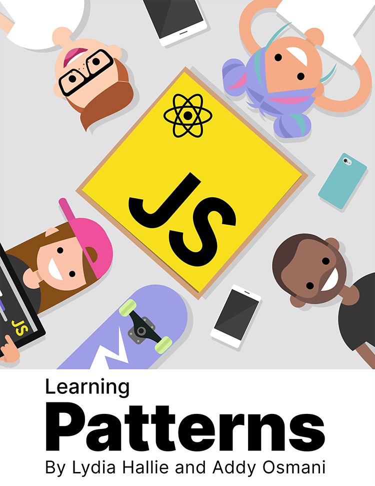

# 学习模式

[去阅读](https://xiaofuyesnew.github.io/learning-patterns/)

[Patterns.dev](https://patterns.dev)

## 翻译进度

- 设计模式
  - [x] 概述
  - [x] 单例模式
  - [x] 代理模式
  - [x] 提供者模式
  - [ ] 原型模式
  - [ ] 观察者模式
  - [ ] 钩子模式

本仓库内容及网站源码遵循 [Creative Commons Attribution-NonCommercial-ShareAlike 4.0 International License](https://creativecommons.org/licenses/by-nc-sa/4.0/)
